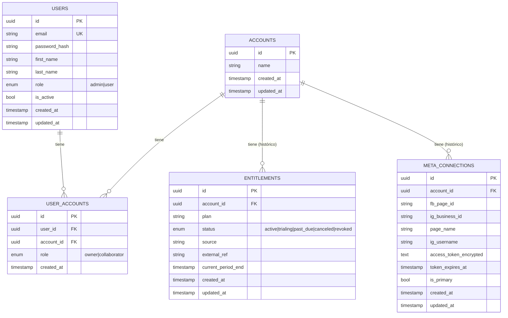

# Modelo de datos

Migración inicial: [`alembic/versions/0001_initial_schema.py`](../alembic/versions/0001_initial_schema.py).
Modelos SQLAlchemy: [`app/models/`](../app/models/).

## Tablas

### `users`
Identidad de plataforma. Solo captura 4 datos en el registro: email, contraseña,
nombre, apellido. `role` es el rol de **plataforma** (`admin`/`user`) — no confundir
con el rol dentro de un negocio.

### `accounts`
Representa el **negocio**, no a la persona. Un usuario puede en teoría pertenecer a
varios (ver `user_accounts`), aunque hoy el registro solo le crea uno.

### `user_accounts` (tabla puente)
Many-to-many entre `users` y `accounts`, con `role` (`owner`/`collaborator`) y unique
constraint en `(user_id, account_id)`.

**Decisión de diseño clave:** aunque hoy la lógica de negocio solo permite que un
usuario tenga un `account` (impuesto en `app/api/routes/auth.py::register`, no en la
base de datos), **no hay ninguna restricción de unicidad en `user_id` a nivel de DB o
de modelo**. Esto es intencional (ver comentario en
[`app/models/user_account.py`](../app/models/user_account.py)): permite relajar esa
regla en el futuro (multi-negocio por usuario) sin migrar el esquema.

### `entitlements`
Plan/acceso de un `account`. Modelada como 1 `account` → muchos `entitlements`
(histórico), aunque hoy cada negocio tiene un único entitlement *efectivo*. Ese
entitlement vigente **nunca se lee de un campo único obligatorio** — se resuelve
siempre vía query (el más reciente con `status in (active, trialing)`), en
`app/api/deps.py::check_entitlement`. Al registrarse, se crea automáticamente uno con
`plan=free`, `status=active`.

### `meta_connections`
Conexión de un `account` a una Página de Facebook + cuenta de Instagram Business.
Modelada como 1 `account` → muchos `meta_connections` (por si en el futuro se permite
más de una página por negocio), aunque hoy solo hay una fila con `is_primary=True` a
la vez (ver `app/api/routes/meta.py::_persist_connection`, que desactiva la anterior
al conectar una nueva). `access_token_encrypted` guarda el token de Meta cifrado con
Fernet — **nunca** se serializa en una respuesta de la API (ver
`app/schemas/meta_connection.py::MetaConnectionStatus`, que ni siquiera tiene ese
campo).
